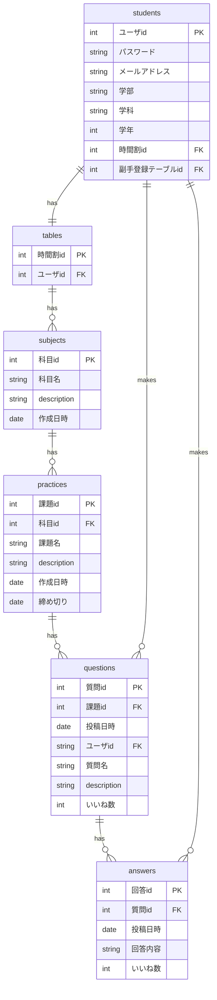

# ER 図

```mermaid
    erDiagram
        students {
            int ユーザid PK
            string パスワード
            string メールアドレス
            string 学部
            string 学科
            int 学年
            int 時間割id FK
            int 副手登録テーブルid FK
        }

        subjects {
            int 科目id PK
            string 科目名
            string description
            date 作成日時
        }

        practices {
            int 課題id PK
            int 科目id FK
            string 課題名
            string description
            date 作成日時
            date 締め切り
        }

        questions {
            int 質問id PK
            int 課題id FK
            date 投稿日時
            string ユーザid FK
            string 質問名
            string description
            int いいね数
        }

        answers {
            int 回答id PK
            int 質問id FK
            date 投稿日時
            string 回答内容
            int いいね数
        }

        tables {
            int 時間割id PK
            int ユーザid FK
        }

        students ||--|| tables : has
        tables ||--o{ subjects : has
        subjects ||--o{ practices : has
        practices ||--o{ questions : has
        questions ||--o{ answers : has
        students ||--o{ questions : makes
        students ||--o{ answers : makes
```
