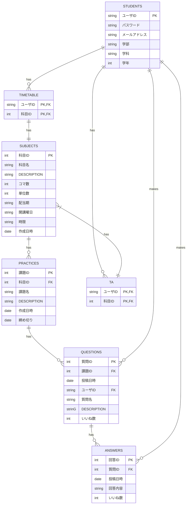

# ER 図

```mermaid
    erDiagram
        STUDENTS {
            string ユーザID PK
            string パスワード
            string メールアドレス
            string 学部
            string 学科
            int 学年
        }

        SUBJECTS {
            int 科目ID PK
            string 科目名
            string DESCRIPTION
            int コマ数
            int 単位数
            string 配当期
            string 開講曜日
            string 時限
            date 作成日時
        }

        PRACTICES {
            int 課題ID PK
            int 科目ID FK
            string 課題名
            string DESCRIPTION
            date 作成日時
            date 締め切り
        }

        QUESTIONS {
            int 質問ID PK
            int 課題ID FK
            date 投稿日時
            string ユーザID FK
            string 質問名
            strinG DESCRIPTION
            int いいね数
        }

        ANSWERS {
            int 回答ID PK
            int 質問ID FK
            date 投稿日時
            string 回答内容
            int いいね数
        }

        TIMETABLE {
            string ユーザID PK,FK
            int 科目ID PK,FK
        }

        TA {
            string ユーザID PK,FK
            int 科目ID PK, FK
        }

        STUDENTS ||--o{ TIMETABLE : has
        TIMETABLE ||--|| SUBJECTS : has
        SUBJECTS ||--o{ PRACTICES : has
        PRACTICES ||--o{ QUESTIONS : has
        QUESTIONS ||--o{ ANSWERS : has
        STUDENTS ||--o{ QUESTIONS : makes
        STUDENTS ||--o{ ANSWERS : makes
        STUDENTS ||--o{ TA : has
        SUBJECTS }|--|| TA : has
```
