# ER 図

```mermaid
    erDiagram
        USERS {
            string ユーザID PK
            string パスワード
            string メールアドレス
            string ニックネーム
            string コメント
            int 所属ID FK
            int 入学年度
            int 学年
            boolean 利用制限
            date created_at
            date updated_at
        }

        TAGS {
            string タグ名 Pk
            int ユーザID PK,FK
            date created_at
            date updated_at
        }

        LIKES {
            string ユーザID PK,FK
            int postID PK,FK
            date created_at
            date updated_at
        }

        FLAGS {
            int ユーザID PK,FK
            int postID PK,FK
            date created_at
            date updated_at
        }

        BELONGING {
            int 所属ID PK
            string 所属学部記号 "教員は教員用の特別な記号"
            int 身分 "大学生=1、大学院生=2、教員=3のいずれかをとる"
        }

        SUBJECTS {
            int 科目ID PK
            string 科目名
            string DESCRIPTION
            string 教室
            string 担当教員
            int コマ数
            int 単位数
            string 配当期
            string 開講曜日
            string 時限
            date created_at
            date updated_at
        }

        PRACTICES {
            int 課題ID PK
            int 科目ID FK
            string 課題名
            string 提出場所
            string DESCRIPTION
            date 締め切り
            date created_at
            date updated_at
        }


        POSTS {
            int postID PK
            int 課題ID FK "PRACTICES.課題ID"
            int QorA "Q=1 A=2"
            int parentID FK "QorA=2の時のみ POSTS.postID"
            string 作成者 FK "USERS.ユーザID"
            string 投稿内容
            date created_at
            date updated_at
        }

        TIMETABLE {
            string ユーザID PK,FK
            int 科目ID PK,FK
            date created_at
            date updated_at
        }

        TA {
            string ユーザID PK,FK
            int 科目ID PK, FK
            date created_at
            date updated_at
        }

        USERS ||--o{ TIMETABLE : has
        USERS ||--o{ FLAGS : has
        USERS ||--o{ LIKES : has
        POSTS ||--o{ FLAGS : has
        POSTS ||--o{ LIKES : has
        TIMETABLE ||--|| SUBJECTS : has
        SUBJECTS ||--o{ PRACTICES : has
        PRACTICES ||--o{ POSTS : has
        USERS ||--o{ POSTS : writes
        USERS ||--|| BELONGING : has
        USERS ||--o{ TA : has
        SUBJECTS }|--|| TA : has
        USERS  ||--|{ TAGS : has
```

<!--
        QUESTIONS ||--o{ ANSWERS : has
        USERS ||--o{ QUESTIONS : writes
        USERS ||--o{ ANSWERS : writes

        QUESTIONS {
            int 質問ID PK
            int 課題ID FK
            date 投稿日時
            string 作成者 FK
            string 質問名
            string DESCRIPTION
            int いいね数
        }

        ANSWERS {
            int 回答ID PK
            int 質問ID FK
            date 投稿日時
            string 回答内容
            int いいね数
        }
-->
